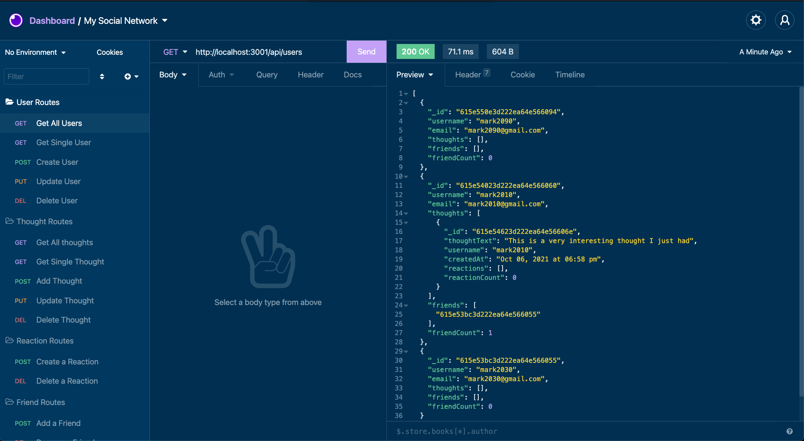

# my-social-network

## Screenshot

## Description

Welcome to the Social Network API, an API for a social network web application where users can create a user profile, share their thoughts, react to friends’ thoughts, and create a friend list.

## Table of Contents

- [Links](#links)
- [Installation](#installation)
- [Tech Used](#tech-used)
- [Questions](#questions)
- [License](#license)

## Links

- **[GitHub Repo](https://github.com/mjos7/my-social-network)**
- [Recorded Video Walk-through Pt. 1](https://www.loom.com/share/0d886e4e3ace49ce9e14d0809d89cb77?sharedAppSource=personal_library)
- [Recorded Video Walk-through Pt. 2](https://www.loom.com/share/5b3c7b7fc29c43d69ef5a0a8850d0fb7?sharedAppSource=personal_library)

## Installation

- Both Node.js and Mongo must be installed on your computer.
- Navigate to the root directory and run:
  - `npm install`
- To start the server, in the command line run:
  - `npm start`

## Tech Used

- Express
- Node
- MongoDB
- Mongoose

## Questions

Please don't hesitate to reach out if you have any suggestions or feedback

## License

This app is licensed under the MIT license.
